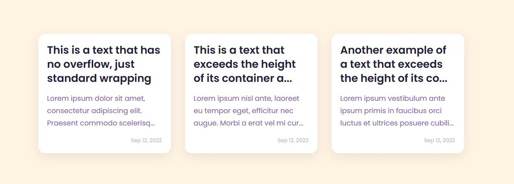
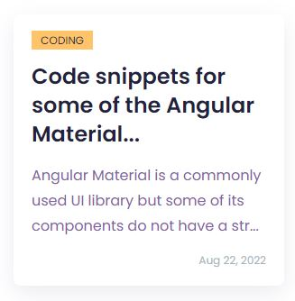

# Angular Multiline Ellipsis Directive
This is a custom directive for adding an ellipsis when a multiline text exceeded the height of its container (overflow).
<br>
## Example


<br>

## Alternatives
There are a few existing workarounds for achieving multiline ellipsis on overflow. [CSS-Tricks](https://css-tricks.com/line-clampin/#the-standardized-way) documented different approaches here. The CSS approach seems to work fine but the behavior is not consistent as I have tested. For example, I have tried this CSS styling:
```css
// Reference: https://css-tricks.com/line-clampin/#the-standardized-way */
text-overflow:ellipsis;
overflow:hidden;
display: -webkit-box;
-webkit-line-clamp: 3;
-webkit-box-orient: vertical;
white-space: normal;
```
and here's what I achieved:
<br>

<br>
From the image, the ellipsis was put on the unexpected text ("Material") causing an off whitespace to the interface. The CSS approach seems to be not a cross-browser solution as well.
<br>
Furthermore, the resource also suggested alternative Javascript libraries. For me, there's no better way to achieve this but through a custom script. However, I'm not much of a fan of using external libraries, thus this custom Angular Directive was implemented.

## Usage
You can download / fork this repository and copy the contents of `src/app/lib` folder to your application.
### Import the directive to your module:
```typescript
@NgModule({
  imports: [
    ...
    MultiLineEllipsisModule
  ],
  ...
})
```
### Use in your templates
```html
<div class="post-wrapper" *ngFor="let post of posts">
  <!-- The class multiline-ellipsis is for fallback purpose only. Can be omitted. -->
  <h3 class="post-title"><a href="#" appLineClamp class="multiline-ellipsis">{{ post.title }}</a></h3>
  <div class="post-excerpt"><p appLineClamp class="multiline-ellipsis">{{ post.excerpt }}</p></div>
  <span class="post-date">{{ post.date }}</span>
</div>
```
The directive is fully customizable should you wish to modify or add features.

## Running the test application
For demo, you can run this application by executing `ng serve` inside the project.<br>
**Note:** The test application runs in Angular 14.

## Additional Notes
- This directive was tested on basic test cases in Chrome, Firefox, and MS Edge.
- This directive was not tested intensively on other cases (e.g. long whitespaces, other browsers). This directive was only used as a solution for a specific case in one of my projects.
- I am very open for suggestions!
